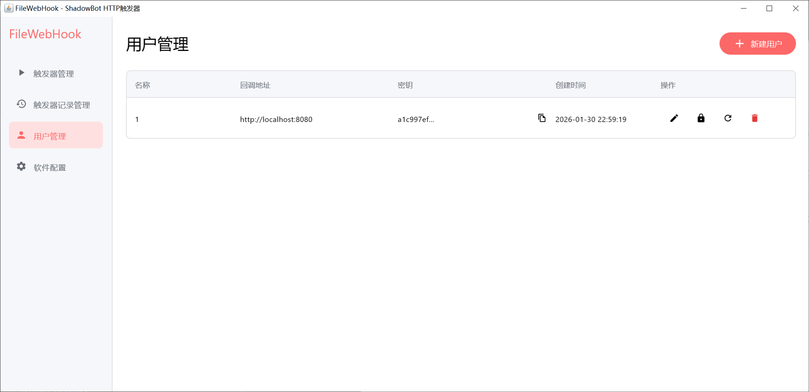

# FileWebHook

<p align="center">
  
</p>

<p align="center">
  <strong>将 HTTP 请求转换为文件触发器的中间件</strong>
</p>

<p align="center">
  <a href="#功能特性">功能特性</a> •
  <a href="#快速开始">快速开始</a> •
  <a href="#使用指南">使用指南</a> •
  <a href="#api-文档">API 文档</a> •
  <a href="#技术架构">技术架构</a> •
  <a href="#贡献指南">贡献指南</a>
</p>

<p align="center">
  
  
  
  
</p>

---

## 简介

FileWebHook 是一个桌面中间件应用，专为 **影刀 RPA** 设计，解决其文件触发器无法直接接收 HTTP 请求的问题。

**工作流程：**

```
外部服务 ──HTTP──> FileWebHook ──文件──> 影刀文件触发器 ──执行──> 影刀机器人
    ↑                                                              │
    └──────────────────────HTTP 回调─────────────────────────────────┘
```

## 功能特性

- 🌐 **HTTP 转文件触发器** - 接收 HTTP 请求，转换为 `request.json` 文件触发影刀
- 🔐 **多用户权限管理** - 支持多用户、多触发器的细粒度权限控制
- 📊 **执行记录追踪** - 完整记录每次执行的请求、响应和耗时统计
- 🔄 **双向回调机制** - 影刀执行完成后自动回调外部服务
- 📋 **FIFO 任务队列** - 串行执行，确保任务有序处理
- 🎨 **现代化 UI** - 基于 Compose Multiplatform 的原生桌面界面

## 快速开始

### 系统要求

- **操作系统**: Windows 10+、macOS 10.14+、Linux (Ubuntu 18.04+)
- **Java**: JDK 17 或更高版本
- **影刀 RPA**: 需安装影刀客户端并配置文件触发器

### 下载安装

从 [Releases](https://github.com/your-username/ShadowBot-FileWebHook/releases) 页面下载对应平台的安装包：

| 平台 | 文件 |
|------|------|
| Windows | `FileWebHook-x.x.x.msi` |
| macOS | `FileWebHook-x.x.x.dmg` |
| Linux | `FileWebHook-x.x.x.deb` |

### 从源码构建

```bash
# 克隆仓库
git clone https://github.com/your-username/ShadowBot-FileWebHook.git
cd ShadowBot-FileWebHook

# 运行应用
./gradlew :composeApp:run

# 打包安装程序
./gradlew :composeApp:packageMsi      # Windows
./gradlew :composeApp:packageDmg      # macOS
./gradlew :composeApp:packageDeb      # Linux
```

## 使用指南

### 1. 配置系统设置

启动应用后，进入「系统设置」页面配置：

| 配置项 | 说明 | 示例 |
|--------|------|------|
| 触发器文件路径 | 影刀文件触发器监听的目录 | `C:\FileWebHook\triggers` |
| HTTP 端口 | 服务监听端口 | `8089` |
| FileWebHook 名称 | 本机标识 | `my-filewebhook` |
| FileWebHook 密钥 | 回调验证密钥 | `your-secret-key` |

### 2. 创建触发器

在「触发器管理」页面创建触发器，每个触发器对应影刀的一个文件触发器：

1. 点击「新建触发器」
2. 填写名称和描述
3. 复制生成的文件夹路径
4. 在影刀中配置文件触发器监听该路径

### 3. 创建用户

在「用户管理」页面为外部服务创建调用凭证：

1. 点击「新建用户」
2. 填写名称和回调地址
3. 保存生成的 `userId` 和 `secretKey`
4. 分配触发器权限

### 4. 启动服务

在「系统设置」页面点击「启动服务」按钮。

### 5. 配置影刀

在影刀中创建文件触发器：

1. 监听路径设置为触发器的文件夹路径
2. 监听文件名设置为 `request.json`
3. 在机器人流程开始时调用 FileWebHook 的 `/trigged` 接口
4. 在机器人流程结束时调用 FileWebHook 的 `/notify` 接口

## API 文档

### 外部服务调用接口

#### POST /trigger/execute

触发执行请求。

**请求体：**

```json
{
  "userId": "用户ID",
  "secretKey": "用户密钥",
  "triggerId": "触发器ID",
  "requestParam": {
    "key1": "value1",
    "key2": "value2"
  }
}
```

**响应体：**

```json
{
  "code": "C_0",
  "message": "请求已接受",
  "eventId": "1-1234567890",
  "triggerId": "1",
  "queuePosition": 0
}
```

**响应码说明：**

| 代码 | 说明 |
|------|------|
| C_0 | 成功 |
| C_1 | 身份验证失败 |
| C_2 | 无权限 |
| C_3 | 触发器不存在 |
| C_4 | 非法业务参数 |
| C_5 | 队列已满 |

### 影刀回调接口

#### POST /trigged

影刀开始执行时调用。

```json
{
  "triggerId": "触发器ID",
  "eventId": "事件ID"
}
```

#### POST /notify

影刀执行完成时调用。

```json
{
  "triggerId": "触发器ID",
  "eventId": "事件ID",
  "responseCode": "200",
  "responseMessage": "执行成功",
  "responseData": {
    "result": "业务返回数据"
  }
}
```

### 外部服务回调

FileWebHook 在收到影刀执行结果后，会回调外部服务：

**URL:** `POST {callbackUrl}/{fileWebHookName}/filewebhook/notify`

**请求体：**

```json
{
  "fileWebHookName": "FileWebHook名称",
  "fileWebHookSecretKey": "FileWebHook密钥",
  "triggerId": "触发器ID",
  "eventId": "事件ID",
  "responseCode": "200",
  "responseMessage": "执行成功",
  "responseData": {},
  "requestTime": "请求时间",
  "shadowBotStartTime": "影刀开始时间",
  "shadowBotEndTime": "影刀结束时间",
  "totalDuration": 5000,
  "shadowBotDuration": 3000
}
```

## 技术架构

### 技术栈

| 类别 | 技术 | 版本 |
|------|------|------|
| 语言 | Kotlin | 2.0.21 |
| UI 框架 | Compose Multiplatform | 1.7.1 |
| HTTP 框架 | Ktor | 3.0.2 |
| 数据库 | SQLDelight + SQLite | 2.0.2 |
| 依赖注入 | Koin | 4.0.0 |
| 序列化 | Kotlinx Serialization | 1.7.3 |

### 项目结构

```
ShadowBot-FileWebHook/
├── composeApp/
│   └── src/
│       ├── commonMain/kotlin/
│       │   ├── data/           # 数据层（模型、仓库）
│       │   ├── domain/         # 业务层（队列、服务）
│       │   ├── server/         # HTTP 服务层
│       │   ├── client/         # HTTP 客户端
│       │   ├── di/             # 依赖注入
│       │   └── ui/             # UI 层
│       └── desktopMain/kotlin/ # Desktop 平台实现
├── gradle/                     # Gradle 配置
└── docs/                       # 文档
```

### 架构模式

采用 **Clean Architecture** 分层架构：

```
┌─────────────────────────────────────────┐
│                UI Layer                 │
│   (Compose Screens, ViewModels)         │
├─────────────────────────────────────────┤
│              Domain Layer               │
│   (TaskQueue, FileService, Validator)   │
├─────────────────────────────────────────┤
│               Data Layer                │
│   (Repositories, Database, Models)      │
└─────────────────────────────────────────┘
```

## 截图

<p align="center">
  
  
</p>

<p align="center">
  
</p>

## 常见问题

### Q: 影刀文件触发器没有响应？

1. 确认触发器文件路径配置正确
2. 确认影刀文件触发器监听的是 `request.json` 文件
3. 检查文件夹读写权限

### Q: 外部服务收不到回调？

1. 确认回调地址可访问（注意防火墙设置）
2. 确认用户配置的回调地址格式正确
3. 检查执行记录中的回调状态

### Q: 队列满了怎么办？

1. 增大「系统设置」中的队列最大长度
2. 检查影刀机器人执行是否卡住
3. 考虑增加影刀并发执行能力

## 贡献指南

欢迎提交 Issue 和 Pull Request！

详见 [CONTRIBUTING.md](CONTRIBUTING.md)

## 许可证

本项目采用 [MIT License](LICENSE) 开源协议。

## 致谢

- [JetBrains](https://www.jetbrains.com/) - Kotlin 和 Compose Multiplatform
- [Ktor](https://ktor.io/) - 异步 HTTP 框架
- [SQLDelight](https://cashapp.github.io/sqldelight/) - 类型安全的 SQL 框架
- [Koin](https://insert-koin.io/) - 轻量级依赖注入框架

---

<p align="center">
  Made with ❤️ for RPA automation
</p>
