# 从0到1快速使用FileWebHook

本教程将带你快速上手 FileWebHook，实现让影刀RPA可以被HTTP调用

---

## 1. FileWebHook 是什么？

FileWebHook 是一个**开源免费**的 Windows 软件，用于让社区版的影刀RPA支持被HTTP调用。

> **GitHub地址**: [https://github.com/15102045545/ShadowBot-FileWebHook](https://github.com/15102045545/ShadowBot-FileWebHook)

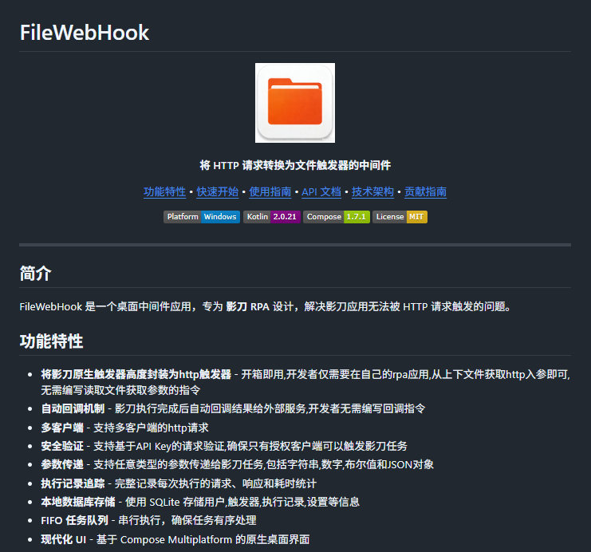

---

## 2. FileWebHook 功能演示

### 2.1 本机调用影刀RPA的应用 - 场景演示

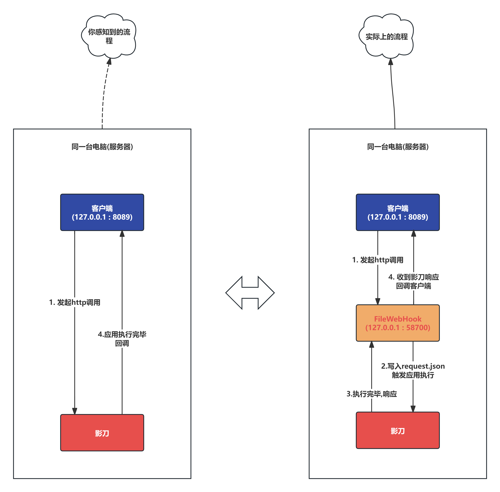

### 2.2 多客户端远程调用影刀RPA的应用 - 场景演示

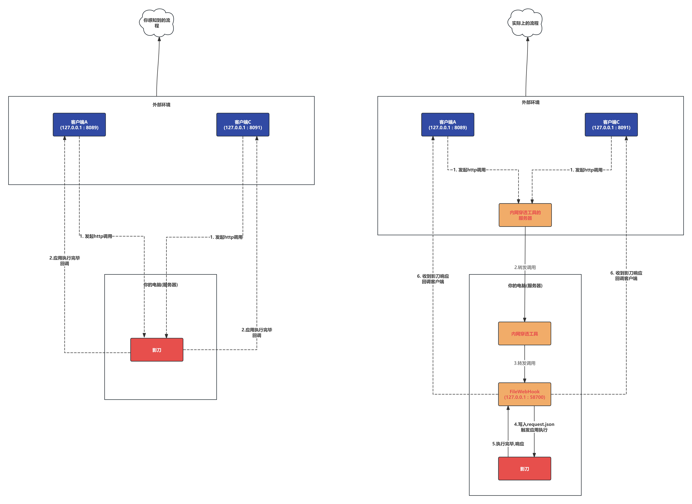

---

## 3. FileWebHook 快速开始

> ⚠️ **说明**: 本章节介绍本机HTTP调用，如需外网调用请额外参考第5章补充说明。

### 3.1 下载并安装 FileWebHook

从 GitHub 的 Release 页面下载最新版本的 `FileWebHook.msi` 安装包，双击安装即可。

> **下载地址**: [https://github.com/15102045545/ShadowBot-FileWebHook/releases](https://github.com/15102045545/ShadowBot-FileWebHook)

### 3.2 FileWebHook - 新建文件触发器

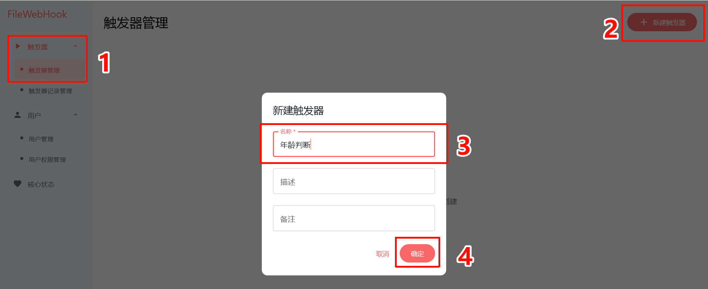

> ⚠️ **注意**: 触发器名称不能为空

### 3.3 影刀侧 - 编写1个基于 FileWebHook-App-Framework 的业务流程应用

#### 3.3.1 先在FileWebHook复制框架指令

找到刚刚新建好的触发器，鼠标点击**复制框架指令**按钮。

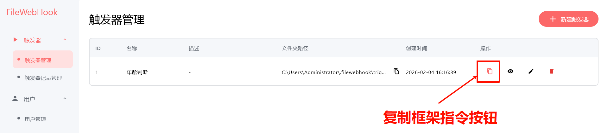

#### 3.3.2 粘贴框架指令到影刀应用

打开影刀RPA，新建一个应用，Ctrl + V 粘贴刚刚复制的框架指令。

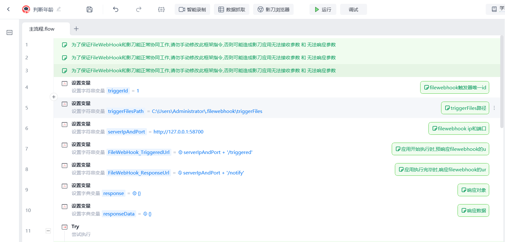

> ⚠️ **注意**: 复制的指令中包含了触发器ID和其他用于和FileWebHook交互的重要变量和指令，**请勿随意更改框架指令内容**。

我这里解释一下,为什么必须是"基于于FileWebHook-App-Framework的应用"

而不能是普通的影刀应用, 因为如果要让影刀自动接收参数,自动发送回调响应
就必须要有1套标准的指令框架去做这些事情, 这就是为什么要用这个框架的原因

有了这个框架,你在业务流程中就可以直接从requestParam变量中获取调用参数
然后把结果放到responseData变量中即可,也完全不需要自己再写http指令手动回调, 框架会自动帮你把结果回调给调用方

#### 3.3.3 然后编写你自己的业务应用逻辑

根据你自己的需要编写应用逻辑，完成后保存应用并发版。

**💡 推荐做法**: 如果你希望保持一个干净的环境来编写自己的业务流程，选中框架指令的第25、26行，右键选择**转为子流程** , 然后在子流程中专注与编写你的业务流程指令。

> 强烈建议这样做，避免你的业务流程和框架流程变量名称或逻辑冲突。

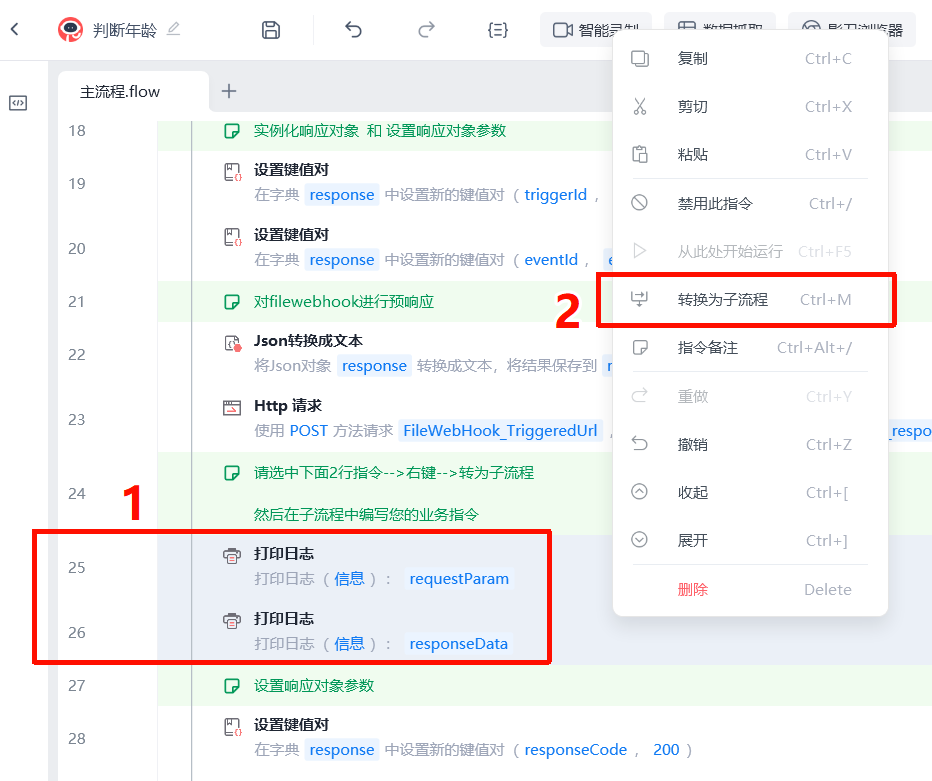
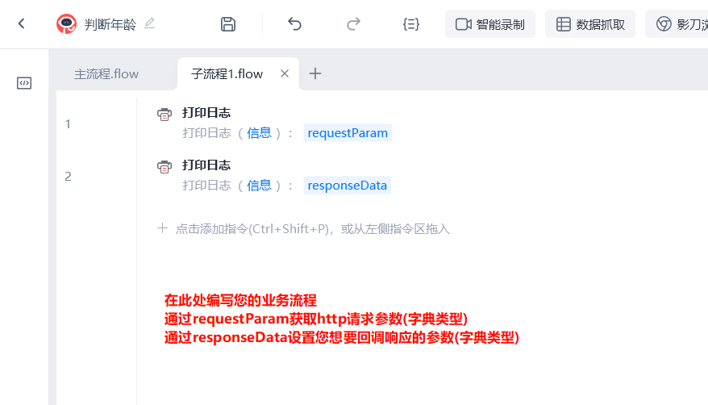

> ⚠️ **注意**: `requestParam` 和 `responseData` 是**字典类型**，如需操作这些变量（获取属性和设置属性），直接使用影刀的原生指令集：
>
> **数据处理 → 字典操作 → xxxx**

#### 3.3.4 保存并发版应用

当你编写完业务流程之后，为你的应用起一个名字，保存并发版。

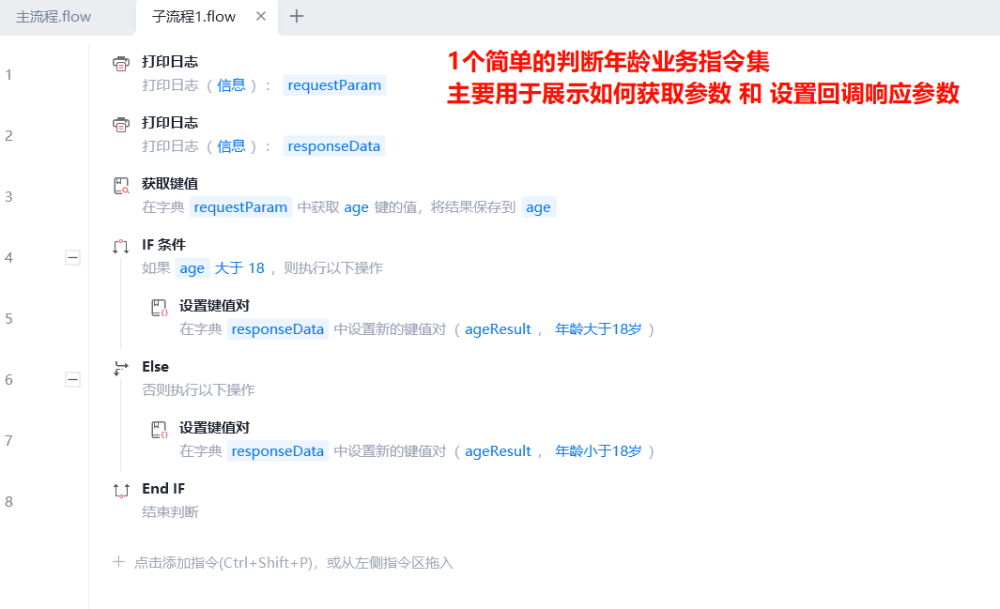

### 3.4 影刀 - 配置特定路径的文件触发器

#### 3.4.1 复制触发器文件夹路径

回到 FileWebHook，点击**复制触发器文件夹路径**按钮。

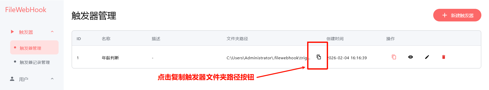

#### 3.4.2 配置影刀文件触发器

回到影刀，新建触发器，选择**文件触发器**，粘贴刚刚复制的路径。

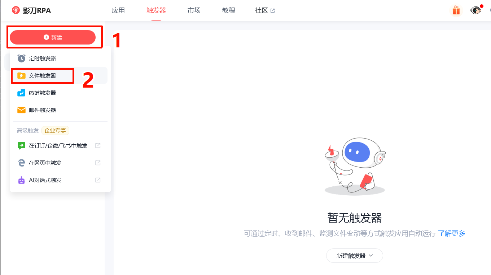
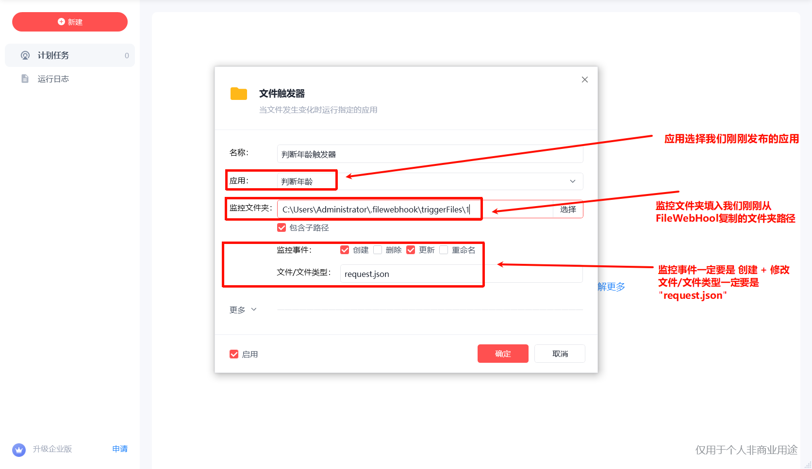

> ⚠️ **注意事项**:
> - 监控文件夹**必须**是从 FileWebHook 中复制出来的路径，否则无法触发
> - 监控事件**必须且只能**选择：`创建` + `修改`
> - 文件/文件类型：只能填入 `request.json`，注意不要含空格等特殊字符

至此，影刀RPA端的配置已经完成，接下来需要配置 FileWebHook 端的用户和权限。

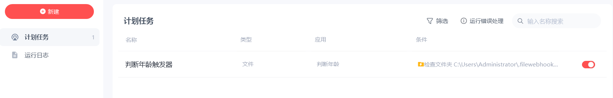
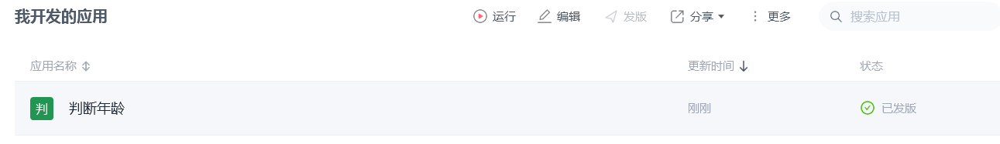

### 3.5 FileWebHook - 新建用户和分配权限

#### 3.5.1 新建用户

新建用户，配置用户名称和回调地址。

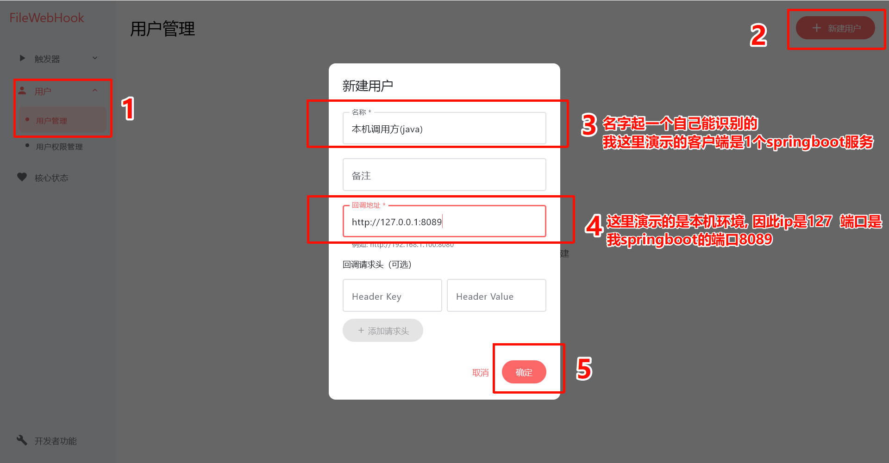

> ⚠️ **注意**: 回调地址必须是 `http` 或 `https` 协议的地址，否则无法回调。

#### 3.5.2 分配权限
在用户管理页面  找到刚刚新建的用户，点击**分配权限**按钮。
然后分配权限并点击确定
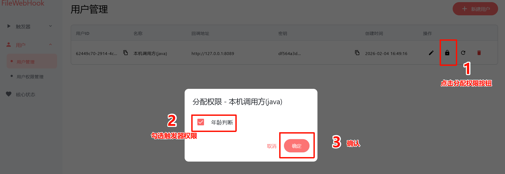

> ⚠️ **注意**: 一定要给用户分配权限，否则无法调用。

---
至此,所有配置工作已经完成, 接下来就可以让客户端发起调用了

## 4. 客户端发起调用

### 4.1 获取调用示例

客户端在调用时，必须提供以下信息：
- 密钥
- 用户ID
- 触发器ID

此外，还需要编写接收 FileWebHook 回调的接口，用于接收调用结果。

这看起来太麻烦了，不是吗？

**好消息是**：FileWebHook 提供了**一键复制调用示例**和**回调接口示例**，大大简化了客户端的调用流程。

进入**用户权限管理**界面，点击**复制调用示例**按钮。

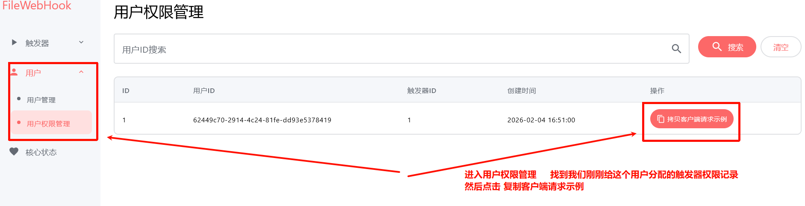

### 4.2 客户端发起调用验证

将复制的客户端调用示例发给你的客户端对接人员。

以本机 Spring Boot 环境为例：将接口信息拷贝到项目里，稍微修改一下请求参数，然后运行。

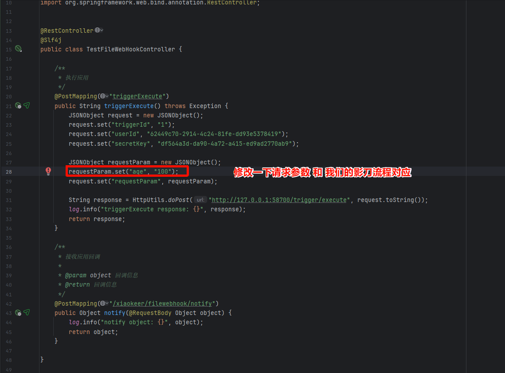

使用 Apifox 触发客户端调用动作：

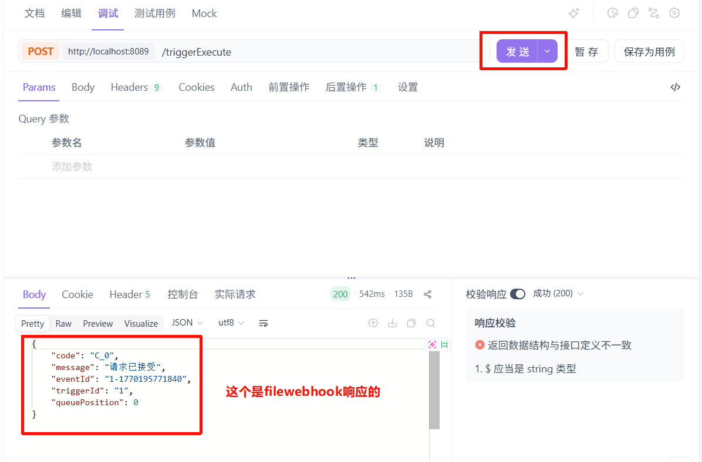

查看日志：

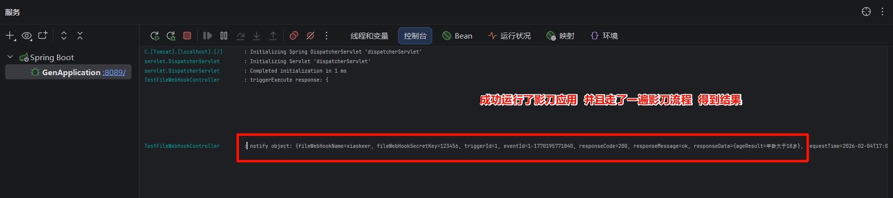

### 4.3 验证完成

至此，FileWebHook 的本机HTTP调用已经完成！

可以多次调用，并观察以下内容来验证整个流程：
- FileWebHook 的队列状态
- 调用记录
- 调用方日志

**查看实时队列信息**: FileWebHook 的**核心状态**菜单

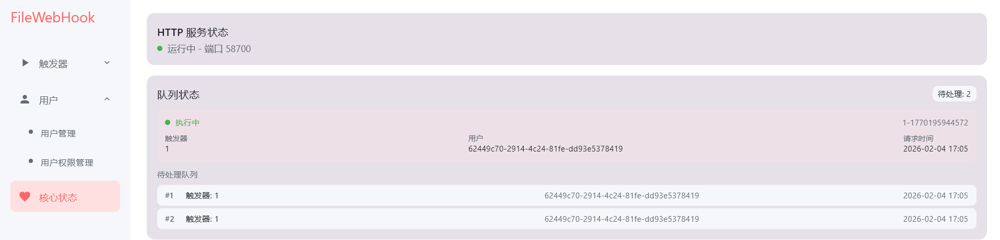

**查看调用记录**: FileWebHook 的**触发器菜单** → **触发器执行记录管理**

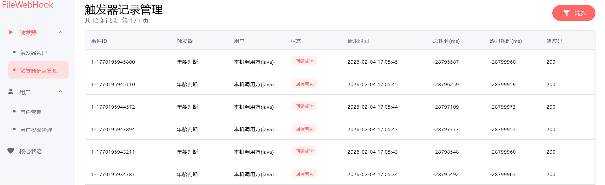

**调用方日志**:

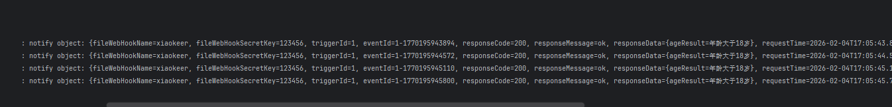

---

## 5. 外网调用补充说明

> 🚧 时间问题，后续补充详细内容

### 5.1 下载并安装贝瑞花生壳

### 5.2 配置内网穿透

### 5.3 修改客户端调用地址

修改客户端调用示例中的地址为花生壳的域名。

### 5.4 修改回调地址

修改用户管理中的回调地址为外网服务器地址。

### 5.5 发起调用验证
